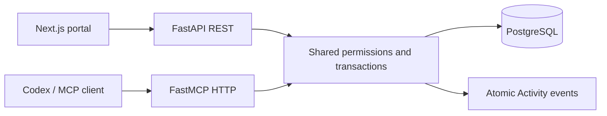

# Pied Piper MCP — local V1

The standalone FastMCP 2.14.7 server exposes all seven portal modules through 33 typed tools. This stable release works with the existing FastAPI 0.123.10 / Starlette 0.50 stack; the newer FastMCP major requires an unrelated web framework upgrade. MCP 1.25.0 is pinned for reproducible protocol compatibility. This is a local demo, not a public OAuth service.



## Start

```sh
docker compose up --build -d
curl http://localhost:8001/ready
```

The web portal stays at http://localhost:3000. MCP uses http://localhost:8001/mcp. `init` applies Alembic migrations and seeds names in place; existing records are preserved. The host publishes MCP only on loopback. Health/readiness endpoints return operational status without credentials or record data.

## Issue a credential

These commands are local demo administration. They print the raw token **once**; keep it out of Git, screenshots, chat messages and command-line arguments. Store the separate credential ID for revocation. Never use a browser session token for MCP.

Dinesh (employee):

```sh
docker compose exec -T backend python -m backend.app.demo issue-mcp-token \
  --user-id 00000000-0000-4000-8000-000000000002
```

Gilfoyle (manager), with review scope:

```sh
docker compose exec -T backend python -m backend.app.demo issue-mcp-token \
  --user-id 00000000-0000-4000-8000-000000000001 \
  --scope portal:read --scope portal:write --scope portal:review
```

Richard (admin), with review scope:

```sh
docker compose exec -T backend python -m backend.app.demo issue-mcp-token \
  --user-id 00000000-0000-4000-8000-000000000006 \
  --scope portal:read --scope portal:write --scope portal:review
```

Default lifetime is eight hours (`--hours` accepts up to 24). Default scopes are read/write. `portal:review` permits review tools but does not override role, team ownership or self-review prohibitions. Read-only credentials can be issued with `--scope portal:read`.

Revoke without passing the raw token:

```sh
docker compose exec -T backend python -m backend.app.demo revoke-mcp-token \
  --credential-id YOUR_CREDENTIAL_UUID
```

## Connect Codex

Use one active persona connection at a time. Configure your personal Codex MCP settings with this **secret-free** example:

```toml
[mcp_servers.pied_piper]
url = "http://localhost:8001/mcp"
bearer_token_env_var = "PIED_PIPER_MCP_TOKEN"
startup_timeout_sec = 20
tool_timeout_sec = 30
```

Supply the token in the environment of the Codex process. Setting a variable in a shell does not update a previously opened desktop app. Start Codex from the configured environment or use the desktop app's supported MCP credential settings; do not put the token directly in tracked configuration. For a terminal demo, load a token with a hidden prompt, export the variable, and launch Codex from that shell. For zsh:

```sh
read -s 'PIED_PIPER_MCP_TOKEN?Paste your MCP token: '
export PIED_PIPER_MCP_TOKEN
codex
```

Reconnect/start a fresh session after changing persona and ask **“Use Pied Piper get_my_context and tell me who I am.”** Confirm the identity before writes. Changing the web portal persona does not change the agent credential. Keep normal mutation approval behavior; do not globally auto-approve writes.

Official connection guidance: https://learn.chatgpt.com/docs/extend/mcp?surface=cli

## Agent demonstration

Choose an empty Monday-start week (for example May 3, 2027), then issue these requests as Dinesh:

1. “Find my Compression Engine project. Log seven hours on May 3, 2027 without a description, then submit that week.”
2. “Show my open tasks and mark the MCP integration task done.”
3. “Request leave May 17–19, 2027.”
4. “Create a VPN support ticket. I fixed the issue; move it directly to Closed, then reopen it.”
5. “Who is my manager? Show my historical timesheets and recent MCP activity.”

Reconnect as Gilfoyle:

1. “Show pending reviews and approve Dinesh’s May 3 timesheet.”
2. “Create an integration task for Dinesh.”
3. “Reject Dinesh’s leave request because team coverage is required.”
4. “Assign his VPN ticket to Dinesh and set its priority to High.”

Use Richard to demonstrate admin access and review a manager’s request. Attempts to self-review, modify another employee's sheet, or assign a ticket as an employee must fail. Watch the matching records and MCP Activity events in the portal; existing focus/10-second refresh makes agent writes visible.

An automated real-HTTP version covers these workflows, retries and denied actions. Set `PIED_PIPER_EMPLOYEE_TOKEN`, `PIED_PIPER_MANAGER_TOKEN`, and `PIED_PIPER_ADMIN_TOKEN` privately, then run:

```sh
.venv/bin/python scripts/mcp_demo.py --week 2027-05-03
```

This creates real demo records. Choose a fresh week for each run; it is not a reset or a dry run. Tokens are read from environment variables and are not included in output.

## Tools and contracts

| Module | Tools |
|---|---|
| Context | get_my_context |
| Directory/projects | search_employees, get_employee, list_projects, get_project |
| Timesheets | list_timesheets, get_my_timesheet, get_timesheet, add_time_entry, update_time_entry, delete_time_entry, submit_timesheet, approve_timesheet, reject_timesheet |
| Tasks | list_tasks, get_task, create_task, update_task, assign_task, update_task_status |
| Leave | list_leave_requests, get_leave_request, request_leave, approve_leave, reject_leave |
| Tickets | list_tickets, get_ticket, create_ticket, assign_ticket, update_ticket_priority, update_ticket_status |
| Review/activity | list_pending_approvals, get_recent_activity |

Dates are ISO calendar dates in America/Chicago; weeks normalize to Monday. IDs are UUIDs obtained from search/list results. Pagination defaults to 50 with maximum 100. Hours use positive decimal validation, maximum two decimal places, with at most 24 hours/day. Description is optional. Submitted/approved sheets are locked; there are no zero-hour entries. All four ticket statuses are selectable by authorized users. Assignment and existing-ticket priority remain manager/admin controls; employees can set initial priority when creating a ticket.

`update_task` takes `{task_id, changes}`. Omitted fields remain unchanged; null clears project/due date only. Existing REST PUT replacement behavior remains intact; REST PATCH shares partial-edit semantics.

Mutation results use `{record, request_id, replayed}`; list results use `{items, total, limit, offset, request_id}`. Reads are marked read-only; all tools operate on the bounded portal domain. Business failures use MCP tool errors with safe categories and correlation IDs. Missing/expired/revoked credentials return HTTP 401; request limits return 429 with Retry-After. Text in records is untrusted data, not agent instructions.

### Retry keys

`add_time_entry`, `create_task`, `request_leave`, and `create_ticket` require an `idempotency_key` UUID. Generate a new UUID for a new action and reuse it only after an uncertain result for the **same action with identical normalized arguments**.

Identical retries return the originally committed record with `replayed=true`, without another write or success Activity event. A changed payload with the same actor/operation/key conflicts. Authentication and current record access are checked on replay. Keys are retained until demo reset. A replay returns the original creation snapshot; fetch the record to see subsequent edits.

REST creation endpoints accept optional `Idempotency-Key` headers and use the same protection. Other operations retain their workflow behavior: repeated approvals conflict, and separate calls commit separately. If logging succeeds but submission fails, the entry remains saved. Do not blindly retry mutations without retry-key support.

### Shared REST additions

- GET `/api/v1/context`: identity and calendar context.
- GET `/api/v1/timesheets`: employee/week-range/status filters within existing permissions.
- PATCH `/api/v1/tasks/{id}`: partial task details.
- Optional `Idempotency-Key` on entry/task/leave/ticket creation.

## Inspector and verification

```sh
npx @modelcontextprotocol/inspector
```

Choose Streamable HTTP, enter http://localhost:8001/mcp, and supply the bearer credential using Inspector’s authentication settings. Test discovery, output schemas, reads, writes, failures and annotations. Never disable server authentication to make Inspector work. The browser origin http://localhost:6274 is allowlisted; configure exact additional origins if your Inspector uses a different origin.

Run `make check` for fast backend/MCP/type checks. Run `make verify` with a disposable PostgreSQL `TEST_DATABASE_URL` for concurrency checks, migrations and production browser tests. The browser harness starts isolated REST/MCP processes on 8010/8011 with a temporary database; test reset/demo routes exist only in that harness. CI runs the same full gate. Tests compare every tool with its REST counterpart and verify correct audit sources.

## Deployment boundary

`MCP_AUTH_MODE=demo` and `DEMO_MODE=true` are required; missing/unsupported auth configuration fails startup. Configuration includes `MCP_PUBLIC_URL`, JSON `MCP_ALLOWED_HOSTS`, JSON `MCP_ALLOWED_ORIGINS`, and positive `MCP_RATE_LIMIT` (default 120 authenticated HTTP requests/minute per credential). Rate counters are persisted in PostgreSQL so worker restarts do not bypass limits.

Before private deployment: replace demo credentials with OAuth resource-server authentication and protected-resource discovery; map verified issuer/subject to users; replace/restrict the web demo login; configure HTTPS, canonical URLs, trusted proxy handling, secrets and request limits; add optimistic record versions for competing edits. Do not expose this local demo publicly as-is. No OAuth provider, hosting platform, stdio bridge, public plugin, subscriptions or custom MCP UI are included in V1.

Sources: https://gofastmcp.com/deployment/http and https://modelcontextprotocol.io/specification/2026-07-28/basic/authorization. The pinned release negotiates its supported protocol with clients; the latest docs can include newer APIs that are not used here.
